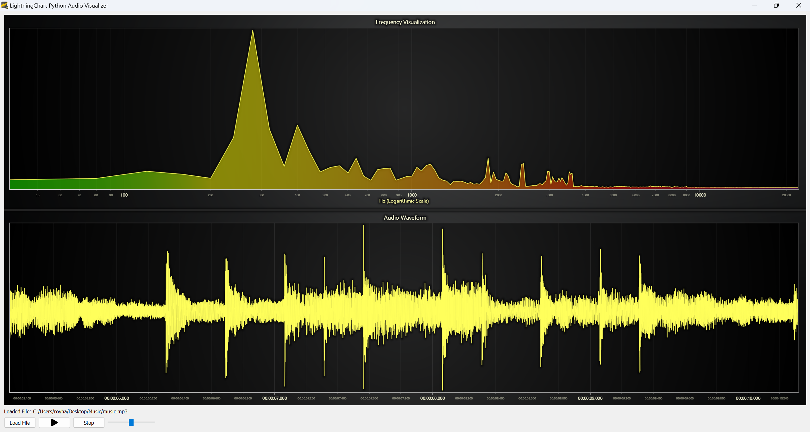
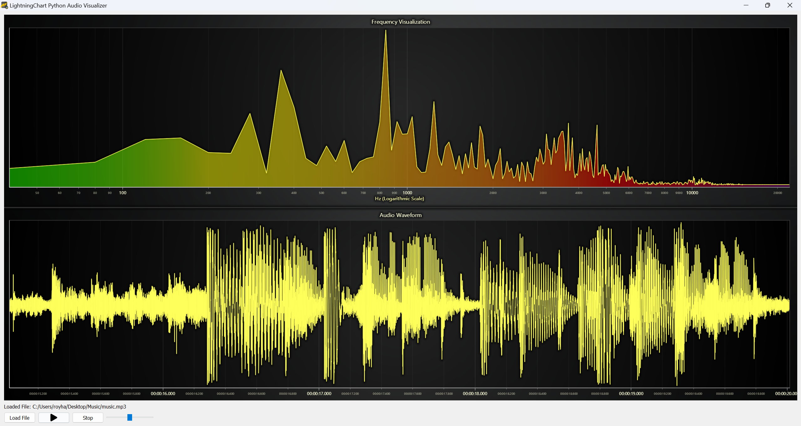
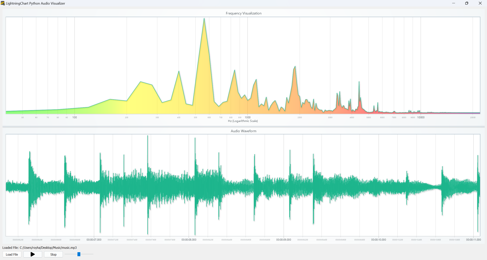

# Python GUI Application Tutorial: Creating a GUI in Python for Real-Time Audio Data Visualization

## Introduction

Developing a desktop application for real-time audio data visualization requires seamless integration of various libraries and frameworks. In this tutorial, we will go through the creation of a Python-based GUI application that leverages LightningChart Python for powerful visualizations and PyQt for a responsive user interface.

### Purpose of the Project

The purpose of this project is to enable users to develop a desktop real-time audio data visualization app using GUI elements and LightningChart Python. This app is designed to process audio files, display their waveform and frequency spectrum, and provide interactivity such as play, pause, and stop.



## Functionalities of the Application

The application includes the following functionalities:

* Audio file import and playback.
* Real-time waveform visualization.
* Frequency spectrum analysis.
* GUI controls for play, pause, stop, and volume adjustment.
* Customizable chart themes.

## LightningChart Python

LightningChart Python is a high-performance charting library that provides advanced data visualization capabilities. It is particularly suited for real-time applications like this one due to its ability to handle large data amount of data efficiently.

### Why LightningChart Python?

LightningChart Python stands out for its:

* Real-time rendering capabilities.
* Support for multiple chart types (e.g., waveform, frequency spectrum).
* Easy customization and theming options.

## Setting Up the Python Environment

To set up the Python environment for this project, you need to install Python and the necessary libraries. This includes installing LightningChart Python, Numpy, PyQt5 and Pygame.

Here's a quick setup guide:

1. **Install Python**: Download and install the latest version of Python from the [official website](https://www.python.org/).
2. **Install Libraries**: Use `pip` to install the required libraries:

   ```bash
   pip install lightningchart PyQt5 pygame numpy
   ```
3. Set up your development environment by creating a new project directory and installing the required libraries. Ensure that LightningChart Python is properly licensed and that required assets like icons are stored in appropriate directories.

### Overview of Libraries

This project integrates several libraries to achieve its functionality:

* **PyQt5** : Provides the GUI framework for building a desktop application. ([documentation](https://www.riverbankcomputing.com/static/Docs/PyQt5/index.html))
* **Pygame** : Handles audio playback and manipulation. ([documentation](https://www.pygame.org/docs/))
* **Numpy** : Used for efficient data processing. ([documentation](https://numpy.org/))
* **LightningChart Python** : For rendering the waveform and frequency spectrum visualizations. ([documentation](https://lightningchart.com/python-charts/docs/))

## UI and Core Features Development

### Basic GUI Layout

The application uses PyQt5 for the GUI layout. Here is the code snippet for creating the main window and layout:

```python
class App(QMainWindow):
    def __init__(self, url, update_waveform, update_frequency, reset_visualization, audio_thread=None):
        super(App, self).__init__()
        self.setWindowTitle("LightningChart Python Audio Visualizer")
        self.setGeometry(100, 100, 800, 600)

        central_widget = QWidget()
        self.setCentralWidget(central_widget)

        self.web_view = CustomWebEngineView()
        self.web_view.setUrl(QUrl(url))

        layout = QVBoxLayout()
        central_widget.setLayout(layout)
        layout.addWidget(self.web_view)
```

### Loading Audio Files

The application provides a seamless experience for loading audio files. Users can either click the **Load File** button to choose their file from a specified directory or simply drag and drop the audio file directly into the application window. This functionality was implemented using PyQt's drag-and-drop events:

```python
def dragEnterEvent(self, event):
    if event.mimeData().hasUrls():
        event.acceptProposedAction()
    else:
        event.ignore()

def dropEvent(self, event):
    urls = event.mimeData().urls()
    if urls:
        file_path = urls[0].toLocalFile()
        if file_path.lower().endswith(('.mp3', '.wav')):
            self.loaded_file_label.setText(f"Loaded File: {file_path}")
        else:
            self.loaded_file_label.setText("Error: Unsupported file type.")

```

This feature eliminates unnecessary clicks, enhancing the user experience.

### Adding Buttons and Controls to the Application

User interaction is a crucial part of any application. In this project, we added essential controls to the app, such as buttons for loading files, starting or pausing playback, stopping playback, and adjusting the volume. These controls were implemented using PyQt5 widgets.

Below is a snippet showing how the buttons and slider were created and added to the application layout:

```python
# Create and add buttons
self.load_button = QPushButton("Load File")
self.load_button.setFixedWidth(100)

self.play_pause_button = QPushButton()  # Single Play/Pause button
self.play_pause_button.setFixedWidth(100)
self.stop_button = QPushButton("Stop")
self.stop_button.setFixedWidth(100)

# Set initial play icon
self.play_icon = QIcon("icons/play-button.png")
self.pause_icon = QIcon("icons/pause-button.png")
self.play_pause_button.setIcon(self.play_icon)

# Add volume slider
self.volume_slider = QSlider(Qt.Horizontal)
self.volume_slider.setRange(0, 100)
self.volume_slider.setValue(50)
self.volume_slider.setFixedWidth(150)
self.volume_slider.setToolTip("Adjust Volume")

```

These buttons were then added to a horizontal layout and integrated into the main interface. Each button is connected to a specific function to enable file loading, control playback, and adjust audio volume. Here’s how the buttons were organized in the layout:

```python
# Add widgets to the layout
button_layout.addWidget(self.load_button)
button_layout.addWidget(self.play_pause_button)
button_layout.addWidget(self.stop_button)
button_layout.addWidget(self.volume_slider)

# Add the button layout to the main layout
layout.addLayout(button_layout)
```

### Chart Integration

Here’s how the charts for waveform and frequency spectrum are initialized:

```python
# Waveform chart setup
waveform_chart = dashboard.ChartXY(column_index=0, row_index=1)
waveform_chart.set_title("Audio Waveform")
waveform_series = waveform_chart.add_line_series(data_pattern='ProgressiveX')

# Frequency chart setup
frequency_chart = dashboard.ChartXY(column_index=0, row_index=0)
frequency_chart.set_title("Frequency Visualization")
frequency_series = frequency_chart.add_area_series(data_pattern='ProgressiveX')
```

### Customizing the Frequency Chart with a Color Palette

To enhance the visualization of the frequency chart, a color palette was applied to represent different frequency ranges with corresponding colors. This makes the frequency spectrum more visually intuitive:

```python
def apply_frequency_palette(series):
    palette_steps = [
        {"value": 20, "color": lc.Color(0, 255, 0, 128)},     # Green with 50% transparency
        {"value": 200, "color": lc.Color(255, 255, 0, 128)},  # Yellow with 50% transparency
        {"value": 1000, "color": lc.Color(255, 165, 0, 128)}, # Orange with 50% transparency
        {"value": 5000, "color": lc.Color(255, 0, 0, 128)},   # Red with 50% transparency
        {"value": 20000, "color": lc.Color(128, 0, 128, 128)} # Purple with 50% transparency
    ]

    series.set_palette_area_coloring(
        steps=palette_steps, look_up_property="x", interpolate=True, percentage_values=False
    )

```

This function is applied to the `frequency_series` to ensure the colors transition smoothly across the frequency range. The result is a visually appealing gradient that highlights the different frequency bands dynamically.

### Customizing the LightningChart Python Theme

LightningChart Python offers customizable themes to adapt the application's appearance to user preferences or branding requirements. At the end, we demonstrate both the `Light` and `Dark` themes. There are also additional themes such as `White`, `Black`, `TurquoiseHexagon` and `Cyberspace`

```python
dashboard = lc.Dashboard(columns=1, rows=2, theme=lc.Themes.Dark)
```

## End Result

Below is a glimpse at the final result showcasing the application in two different themes:





## Conclusion

By combining LightningChart Python's robust visualization tools with PyQt's flexible GUI capabilities, this project demonstrates how to create a dynamic audio visualization application. For those interested in exploring further or running the code, refer to the source code.
